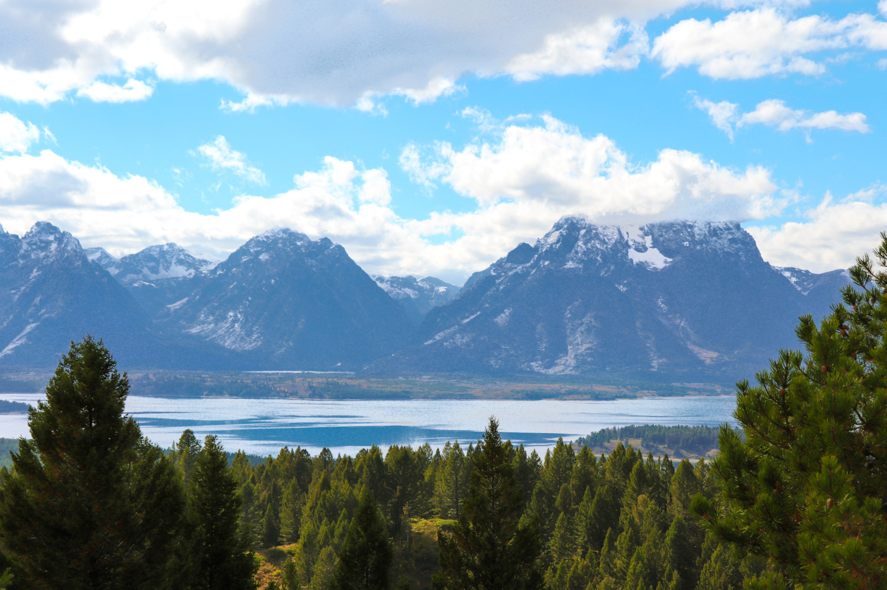

## About Me:

I am a PhD student in Civil Engineering at the University of Nebraska–Lincoln, where my research focuses on the empirical and simulation-based analysis of automated vehicle trajectories. My work aims to improve car-following behavior and vehicle–pedestrian interactions in mixed traffic environments by leveraging machine learning, big data, and behavioral modeling.

Before starting my doctoral journey, I spent nearly a decade as a Senior Transportation Engineer at TrafQuest in Dubai, UAE, where I led and supported over 100 transportation studies across the MENA region. These included transportation master plans, traffic impact studies, and multimodal integration projects for major developments and city-scale planning efforts. My role also involved producing traffic simulations, conducting feasibility and sustainability reviews, and developing demand forecasting models.

Academically, I hold both a Master’s and Bachelor’s degree in Civil Engineering (Transportation) from the Jordan University of Science and Technology.

In my current role as a Graduate Research Assistant, I explore the intersection of automated mobility, data-driven planning, and traffic safety, with particular interest in methods that combine spatiotemporal data, simulation tools, and machine learning and artificial intelligence frameworks to support more intelligent and adaptive transportation systems.

## More About Me

Outside of engineering and research, I enjoy a mix of both indoor and outdoor worlds, as long as I can experience them without crowds, noise, or anyone asking me to explain traffic flow theory during a game or at a some viewpoint.

I'm an avid soccer fan, a casual photographer, a lover of nature, and a lifelong enthusiast of computers and tech stuff. I also happen to be a gamer.. and I mean all of it: modern titles, retro classics, and everything in between. I can lose myself equally in a research dataset or a vintage GBC cartridge.

Since moving to the U.S., I've tried to make the most of it: I visited 10 states in my first year and added 5 more in the second, exploring 10 national parks along the way. I've learned that I enjoy being outdoors as long as there’s a nice view, and indoors, as long as I have a controller, keyboard, or something to tinker with.

*Grand Teton National Park on National Public Lands Day - September 2023.*

I was born and raised in the UAE, and I speak both Arabic and English. I’m also a proud millennial and, best of all, a proud father of one beautiful daughter.

[View My Research](research.md)  
[Read My Publications](publications.md)  
[Go Back to Homepage](index.md)
