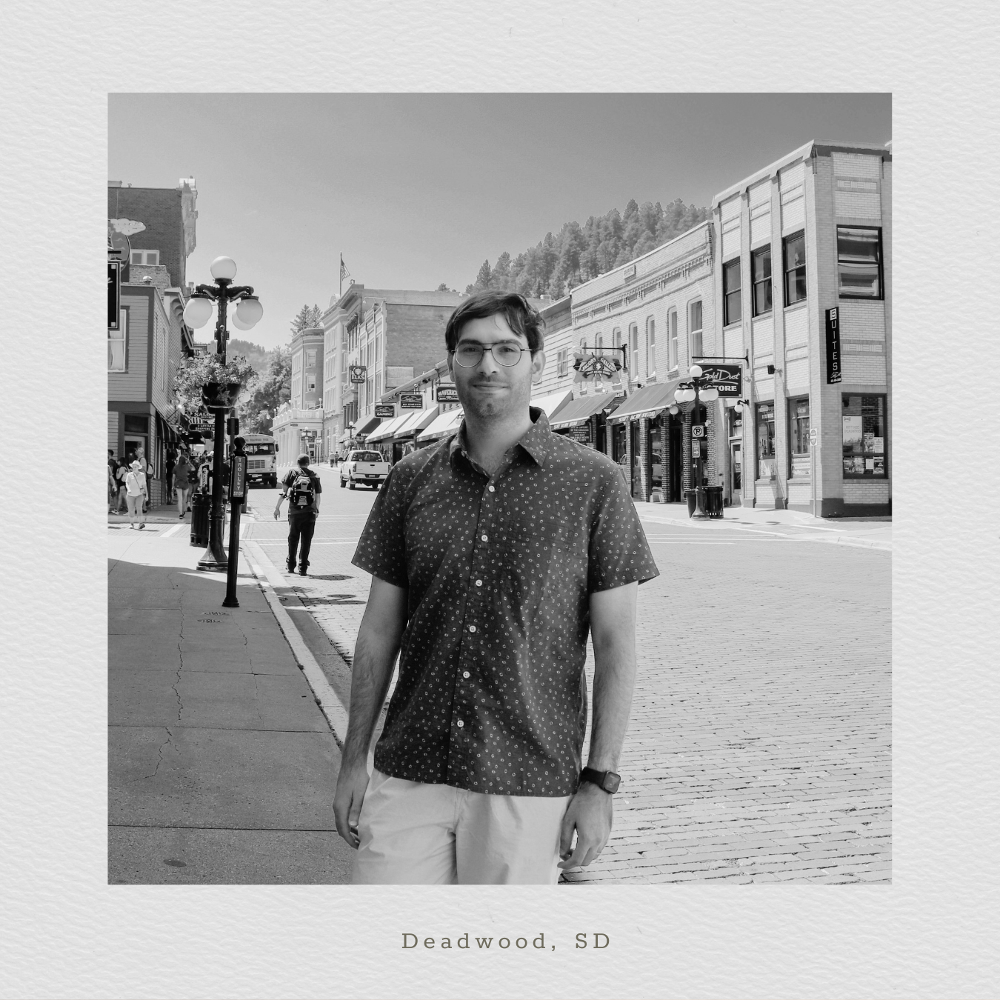

## About Me:

I am a PhD student in Civil Engineering at the University of Nebraska–Lincoln, where my research focuses on the empirical and simulation-based analysis of automated vehicles behavior. My work seeks to refine AV driving and interactions in diverse traffic conditions, drawing on methods that stretch from trial-and-error to artificial intelligence.

Before starting my doctorate, I spent nearly a decade in Dubai, UAE, where I grew into a Senior Transportation Engineer role and led more than 100 transportation projects across the MENA region. These included transportation master plans, traffic impact studies, and multimodal integration projects for major developments and city-scale planning efforts. My role also involved producing traffic simulations, conducting feasibility and sustainability reviews, and developing demand forecasting models.

Academically, I hold both a Master’s and Bachelor’s degree in Civil Engineering (Transportation) from the Jordan University of Science and Technology.

In my current role as a Graduate Research Assistant, I explore the intersection of automated mobility, data-driven planning, and traffic safety, with particular interest in methods that combine spatiotemporal data, simulation tools, and machine learning and artificial intelligence frameworks to support more intelligent and adaptive transportation systems.

## More About Me

Outside of engineering and research, I enjoy a mix of both indoor and outdoor worlds, as long as I can experience them without crowds, noise, or anyone asking me to explain traffic flow theory during a game or at a some viewpoint.

I’m a football fan, the one that passes a "does it look like a ball?" test. I take photos, I travel, I like being outdoors. I’ve also been messing around with computers and tech for as long as I can remember. And I game a bit of everything, from today’s hits to vintage GBC cartridges (that's mainly a Pokémon reference). 

Since moving to the U.S., I've tried to make the most of it: I visited 10 states in my first year and added 5 more in the second, exploring 10 national parks along the way. I've learned that I enjoy being outdoors as long as there’s a nice view, and indoors, as long as I have a controller, keyboard, or something to tinker with.

*Collecting states like souvenirs, but way heavier on the SD card.*

I was born and raised in the UAE, and I speak both Arabic and English. I’m also a proud millennial and, best of all, a proud father of one beautiful daughter.

[View My Research](research.md)  
[Read My Publications](publications.md)  
[Go Back to Homepage](index.md)

