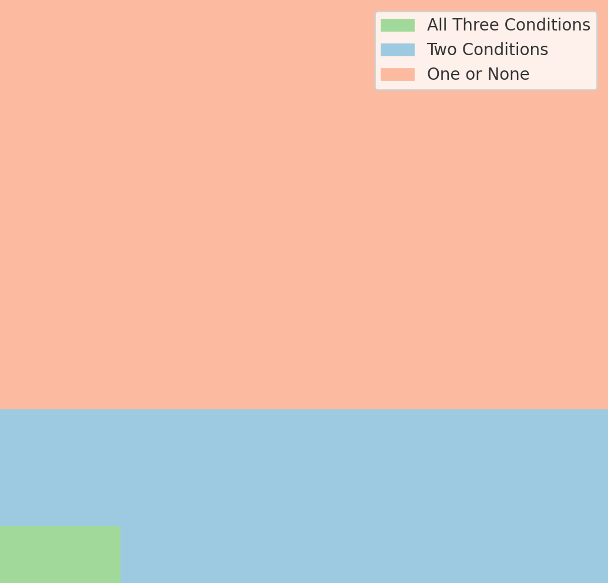
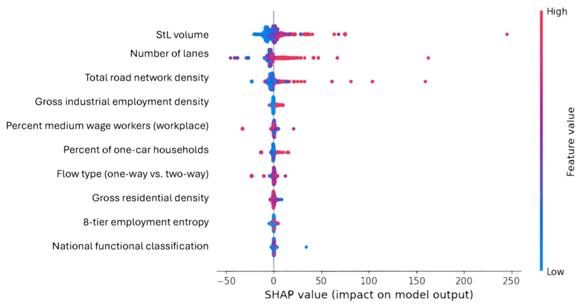

# Research
I am currently a researcher at **Dr. Wissam Kontar’s lab** at the University of Nebraska-Lincoln, focusing on **automated vehicle (AV) behavior analysis based on empirical and simulation data** to improve safety and efficiency in mixed traffic environments.

### Key Topics:
- Empirical Analysis of AV Interaction and Behavior in Urban Mixed Traffic
- Designing Consensus-Aware Automated Vehicles under Competing Objectives
- AV Behavior Trade-offs in Varying Traffic Contexts
- Big Data and Smart Data for Traffic Safety Analysis
- Machine Learning in Demand Forecasting and Safety Analysis
- Activity Sequencing and Dynamic Time Warping (DTW)  

### Understanding Trade-offs in AV Behavior

In our recent study, *"Consensus-Aware AV Behavior: Trade-offs Between Safety, Interaction, and Performance in Mixed Urban Traffic,"* we analyzed high-resolution trajectory data from the TGSIM dataset to explore how automated vehicles behave at signalized urban intersections, particularly around pedestrians and other vulnerable road users.

We proposed a new evaluation framework that considers three interdependent performance dimensions: safety, interaction quality, and traffic performance. Through empirical analysis, we found that AVs often prioritize safety but fall short in interaction clarity and traffic flow efficiency. Notably, only **1.63%** of AV–pedestrian interaction frames achieved full consensus across all three dimensions.

This work underscores the importance of explicitly modeling consensus trade-offs when designing AV behavior policies. We are now advancing to the next phase: developing a consensus-aware behavioral framework to help AVs balance these dimensions in real-world deployment.

📄 [Read the Paper on arXiv](https://doi.org/10.48550/arXiv.2505.04379)  
📂 [See the Analysis Code on GitHub](https://github.com/wissamkontar/Consensus-AV-Analysis)

### Modeling Crash Count and Severity Using Street-Level Imagery  

This study leverages Mapillary Open Street-View (OSV) detections and StreetLight-calibrated traffic data to enhance pedestrian crash modeling in Lincoln, NE. By integrating these smart data sources, the work demonstrated how detailed real-world variables—mapped at the level of uniform grid squares—improve crash count and severity prediction using both generalized linear models and machine learning approaches.

  
<strong>Results of the Severity RF Classifier Model with Balanced Weights</strong>

  <table>
    <thead>
      <tr>
        <th>Class</th><th>Precision</th><th>Recall</th><th>F1-score</th><th>Support</th>
      </tr>
    </thead>
    <tbody>
      <tr><td>1 (Property damage only)</td><td>0.40</td><td>1.00</td><td>0.57</td><td>12</td></tr>
      <tr><td>2 (Possible injury)</td><td>0.86</td><td>0.74</td><td>0.80</td><td>262</td></tr>
      <tr><td>3 (Visible injury)</td><td>0.82</td><td>0.81</td><td>0.82</td><td>264</td></tr>
      <tr><td>4 (Serious injury)</td><td>0.73</td><td>0.85</td><td>0.79</td><td>110</td></tr>
      <tr><td>5 (Fatal)</td><td>0.88</td><td>1.00</td><td>0.94</td><td>15</td></tr>
      <tr><td><strong>Overall Accuracy</strong></td><td></td><td></td><td>0.80</td><td>663</td></tr>
    </tbody>
  </table>

📄 [Preprint Available on ResearchGate](https://www.researchgate.net/publication/382926999_Better_Safety_Analyses_through_Smarter_Data_Adding_Open-Street-View_and_Traffic_Calibrated-LBS_Data_to_Pedestrian_Crash_Analysis_in_Lincoln_NE)  

### Calibrating Traffic with LBS Data and Smart Data

In collaboration with NDOT, we developed Random Forest models to calibrate StreetLight location-based services (LBS) data into actual pedestrian, bicycle, and vehicle volumes using traditional count data, EPA Smart Location Database metrics, and roadway attributes. Our models achieved exceptionally high predictive accuracy across all modes. Feature importance and SHAP analysis confirmed that while StreetLight indicators were strong predictors, contextual variables like lane count, land use density, and socioeconomic attributes significantly improved predictions for pedestrian and bicycle modes. These findings highlight the power of integrating commercial mobility data with public datasets for scalable, mode-specific traffic estimation, especially in data-sparse environments.

*Beeswarm SHAPley Plot for the Bicycle Volume Model*

📂 [See the Calibration Code on GitHub](https://github.com/Hawkins-TECH-Lab/NDOT-Calibration)   
📄 [Full Text Available on ResearchGate](https://www.researchgate.net/publication/390051928_Integrating_StreetLight_EPS_Smart_Location_Data_and_Road_Attributes_A_Random_Forest_Approach_to_Multi-Modal_Traffic_Calibration_in_Lincoln_Nebraska)

### More Research
- Modeling Pedestrian and Bicyclist Crash Exposure using Location-Based Service Data
- Modeling Driver's Gap Acceptance Behavior Using Empirical Data

[See My Publications](publications.md)   
[Go Back to Homepage](index.md)
